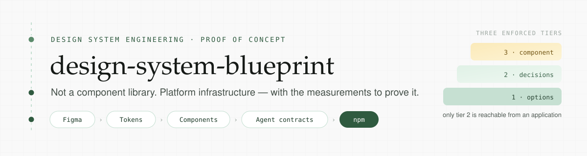
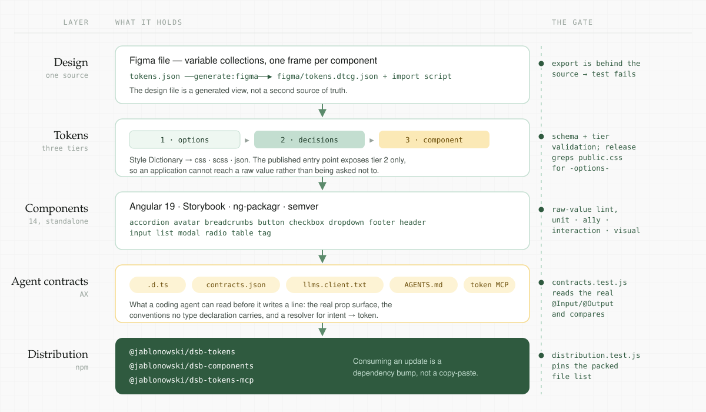

<p align="center">
  
</p>

<p align="center">
  <a href="https://github.com/jablonowski/design-system-blueprint/actions/workflows/verify.yml"></a>
  <a href="https://www.npmjs.com/package/@jablonowski/dsb-tokens"></a>
  <a href="https://www.npmjs.com/package/@jablonowski/dsb-components"></a>
  <a href="https://www.npmjs.com/package/@jablonowski/dsb-tokens-mcp"></a>
  <a href="LICENSE"></a>
</p>

<p align="center">
  
  
  
  
  <a href="https://github.com/jablonowski/demo-blueprint"></a>
</p>

---

A working proof of concept for treating a design system as **platform infrastructure**
rather than as a component collection. Every design value starts in one file and arrives in
an application as an installed package — through enforced tier boundaries, a tested
component library, and contracts a coding agent can read before it writes a line.

Small on purpose. Nothing in it is faked.

<p align="center">
  
</p>

## The short version

- **One source of truth.** Values live in `tokens.json`. The Figma file is generated from
  it, and a test fails when the export falls behind.
- **Three tiers, enforced at build time.** Applications can reach tier 2 and nothing else —
  because the published entry point contains nothing else, not because a document asks
  nicely.
- **Fourteen Angular components**, standalone, documented in Storybook, covered by unit,
  accessibility, interaction and visual-regression tests.
- **Contracts for coding agents.** Type declarations, a validated component contract,
  `llms.client.txt` shipped inside the tarball, `AGENTS.md`, and a token resolver over MCP.
- **Three npm packages**, released by GitHub Actions. Consuming an update is a dependency
  bump.

Every one of those layers has a gate that runs on every pull request. Where a gate was wrong
or missing, the repository says so rather than quietly fixing it.

## Try it

```bash
npm run install:all
npm run verify
```

`verify` runs the browser-free half of the suite: token lint, schema and tier validation,
token build, CSS output assertions, the Token MCP contract suite, the strict raw-value
guard, the component API contract test, unit tests, and `llms.txt` generation.

→ [Getting started, in full](docs/start.md#getting-started)

## Is any of this measurable?

A companion repository puts it to the test: **[demo-blueprint](https://github.com/jablonowski/demo-blueprint)** —
a pre-registered experiment asking whether this design system changes what a coding agent
actually writes. One specification, one application, five levels of infrastructure,
committed scorers, raw data published per run.

Stage one is complete: thirty-five scored runs, five arms at n = 5 on one model and n = 2 on
a second. Published in that repository: the results, the method, every discarded run — and
the comparisons that went against this repository's own premise, including a scorer removed
mid-study because it was producing a difference that was not there, and two claims withdrawn
once a second run failed to reproduce them.

→ [Raw results and methodology](https://github.com/jablonowski/demo-blueprint)

## Documentation

Everything else — how each layer is built, what each gate catches, and the decisions behind
both — lives in `docs/`.

### → **[Go to the docs](docs/start.md)**

| | |
|---|---|
| [Getting started](docs/getting-started.md) | Prerequisites, install, the one command that verifies everything |
| [Design tokens](docs/tokens.md) | The three tiers, how the boundary is enforced, the public surface |
| [Figma sync](docs/figma-sync.md) | Why the design file is a generated view, and what the audit settled |
| [Components](docs/components.md) | The Angular library, Storybook, packaging |
| [Testing](docs/testing.md) | Seven layers, each catching what the others cannot |
| [Visual regression](docs/visual-regression.md) | Lost Pixel, and why baselines are committed *and* generated in CI |
| [Agent contracts (AX)](docs/ax-contracts.md) | What an agent reads before it writes UI against this system |
| [Token MCP](docs/token-mcp.md) | The resolver, its four gates, and why `no-coverage` is the easy path |
| [CI and release](docs/ci-release.md) | Workflows, publishing, local token changes |
| [Known caveats](docs/caveats.md) | What this does not do, stated plainly |

## Design source

[Figma file](https://www.figma.com/design/iJ92LuFOsPjO6avZ2anbwO/Design-System-Blueprint?node-id=0-1&p=f&t=VBrE2AqIFZxxbNaO-0) —
deliberately plain. The point is the pipeline, not winning a design award.

---

⭐ This project is 100% powered by caffeine and unpaid passion. Give it a ⭐ if you like it 😊 Thanks ❤️

Built by [Mateusz Jabłonowski](https://jablonowski.eu). [MIT](LICENSE).
