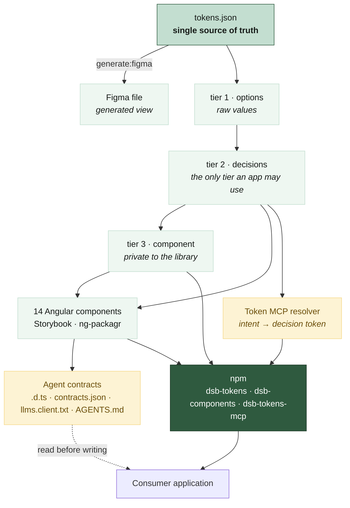

# Documentation

[← back to the README](../README.md)

Ten documents. Read them in any order; the map below says what is in each and why it
exists.

## How the pieces fit

The same picture, drawn: [`assets/architecture.svg`](assets/architecture.svg).

## The documents

### Build and run

- **[Getting started](getting-started.md)** — prerequisites, the three npm projects, and
  `npm run verify`. Start here if you just cloned the repository.

### The system

- **[Design tokens](tokens.md)** — the three-tier architecture, how the boundary is
  enforced at build time, and what the published surface actually contains.
- **[Figma sync](figma-sync.md)** — why the design file is generated from the token source
  rather than feeding it, what the generator emits, and the three measurement differences
  an audit turned up.
- **[Components](components.md)** — the Angular library, how it is developed and packaged.

### What keeps it honest

- **[Testing](testing.md)** — seven layers, what each one catches, and which need a
  browser.
- **[Visual regression](visual-regression.md)** — Lost Pixel. Two rules about baselines
  that look like trivia and are not.
- **[CI and release](ci-release.md)** — the verify workflow, the four publish workflows,
  and how to consume unpublished token changes locally.

### Agent experience

- **[Agent contracts (AX)](ax-contracts.md)** — type declarations, the validated component
  contract, the raw-value guard, and the two `llms` artifacts.
- **[Token MCP](token-mcp.md)** — the resolver, its four gates, and why refusing to answer
  is the cheapest path through the code.

### The fine print

- **[Known caveats](caveats.md)** — what this repository does not do, and which of its own
  contracts has no test behind it.

## Related

The companion experiment — [demo-blueprint](https://github.com/jablonowski/demo-blueprint) —
measures whether any of this changes what a coding agent writes. Thirty scored runs, five
arms, raw data published per run, including the comparisons that went against this
repository's premise.
